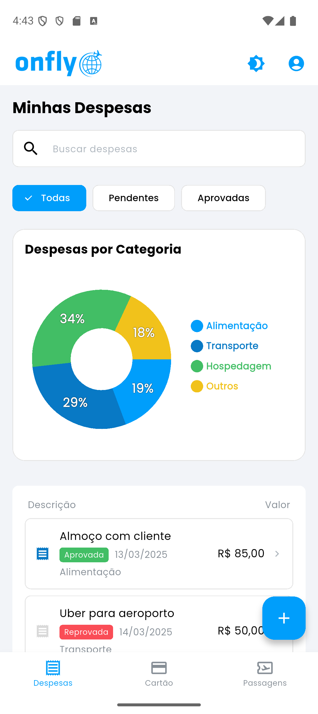
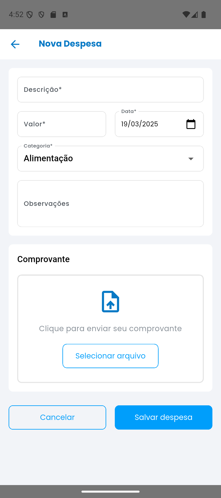
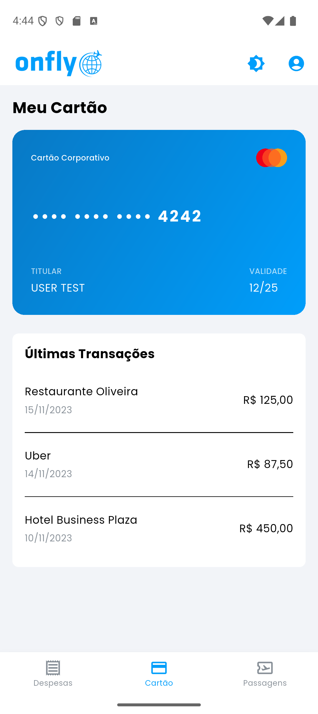
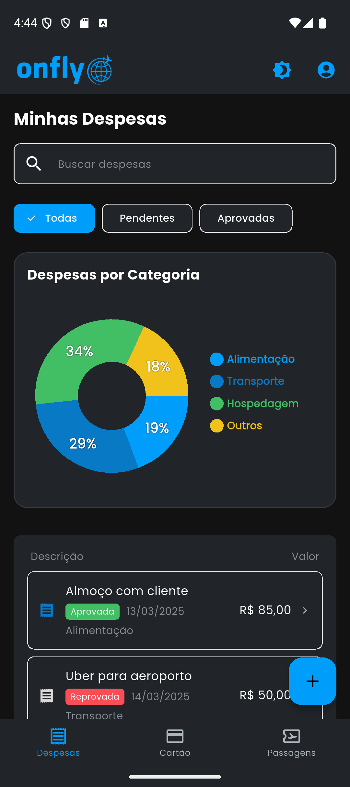
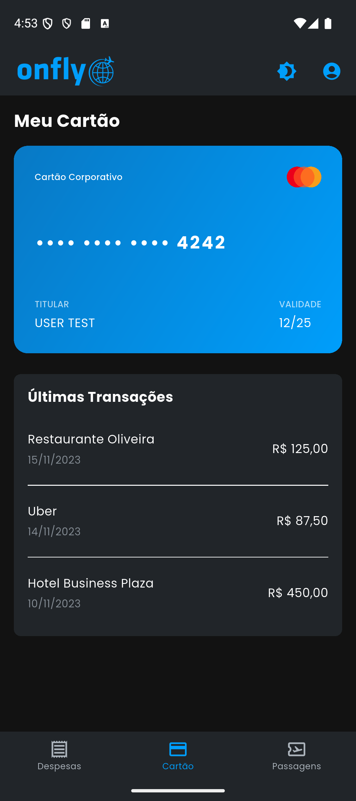

# Onfly Sistema de Gestão de Despesas

Este projeto é um **sistema de gestão de despesas de viagens corporativas** desenvolvido com **Flutter** (abordagem offline-first), um pacote **Design System** e um **backend leve em Dart (Shelf)**. A arquitetura segue a **Clean Architecture** e utiliza **Drift** (SQLite) para armazenamento de dados offline, garantindo que os usuários possam gerenciar despesas mesmo sem conexão com a internet.

## 📱 Capturas de Tela

|                                                            |                                                          |                                                            |
| ---------------------------------------------------------- | -------------------------------------------------------- | ---------------------------------------------------------- |
|  |  |  |
|  |  |    |
|    |  |  |

## 🔎 Visão Geral

| Componente              | Descrição                                                                    |
| ----------------------- | ---------------------------------------------------------------------------- |
| **onfly_app** (Flutter) | Aplicação móvel para gerenciamento de despesas corporativas (offline-first). |
| **onfly_design_system** | Pacote independente contendo componentes reutilizáveis de UI, cores e temas. |
| **onfly_server** (Dart) | Backend simples em Dart usando Shelf para lidar com requisições API.         |

### Principais Funcionalidades

- **Offline-First**: Os dados são armazenados localmente (via **Drift** (SQLite)) e sincronizados com o servidor quando online.
- **Clean Architecture**: Separação clara das camadas **Dados**, **Domínio** e **Apresentação**.
- **Injeção de Dependências**: Utiliza Flutter Modular para arquitetura modular, onde cada módulo (Auth, Despesas, etc.) é independente e autocontido, com suas próprias rotas, dependências e lógica de negócios.
- **Gerenciamento de Estado**: Utiliza Cubit da arquitetura BLoC.
- **Upload e Compressão de Imagens**: Envia recibos de despesas em **Base64**, comprimidos via `flutter_image_compress`.
- **Design System**: UI consistente e estilização de marca do pacote **onfly_design_system**.
- **Backend Leve**: Um servidor Dart com arquitetura MVC que fornece endpoints REST para **Despesas**, **Autenticação** e mais.

## 🏗 Arquitetura

Este projeto segue **Clean Architecture** para o app Flutter e **MVC** para o backend Dart:

```
Domínio
┣ Entidades (Expense, etc.)
┣ Casos de Uso (AddExpense, GetExpenses, etc.)
┗ Repositórios (Interfaces)

Dados
┣ Modelos (ExpenseModel)
┣ Fontes de Dados (Remoto, Local/Drift)
┗ Implementações de Repositórios

Apresentação
┣ Cubit (ExpensesCubit)
┗ Páginas de UI (ExpensesPage, etc.)
```

```
Backend (MVC)
┣ Controladores (Auth, Expense)
┣ Modelos
┣ Repositórios
┣ Serviços
┣ Utils
┣ routes.dart
┗ bin/main.dart
```

### Fluxo Offline-First

1. **Banco de Dados Local (Drift)** → Todas as despesas são armazenadas localmente em um banco SQLite.
2. **Sincronização Remota** → Sempre que o aplicativo inicia ou ocorre uma operação CRUD, o banco local é atualizado e uma tentativa de sincronização com o servidor remoto é realizada.
3. **Resolução de Conflitos (Simples)** → O projeto inclui um método simples (`syncExpenses`) para enviar dados não sincronizados ao servidor e, em seguida, buscar os dados mais recentes para atualizar o banco de dados local.

## 📂 Estrutura do Repositório

```
onfly_repo
├── onfly_app            # Aplicação móvel Flutter
├── onfly_design_system  # Pacote de design system independente
├── onfly_server         # Backend Dart baseado em Shelf
├── README.md            # Esta documentação
└── .gitignore
```

## 🛠️ Instalação e Configuração

1. **Clone o repositório:**

```bash
git clone https://github.com/limadlp/onfly_test.git
cd onfly_repo
```

2. **Configuração do Backend (`onfly_server`):**

```bash
cd onfly_server
dart pub get
dart run bin/main.dart
```

- O backend será executado em **localhost:5000** (ou na porta configurada).

3. **Configuração do Design System (`onfly_design_system`):**

```bash
cd onfly_design_system
dart pub get
```

- Este pacote pode ser importado pelo app ou qualquer projeto Flutter que precise de uma identidade visual consistente da Onfly.

4. **Configuração do Aplicativo Móvel (`onfly_app`):**

```bash
cd onfly_app
flutter pub get
flutter run
```

### Credenciais de Teste

Para testar a aplicação, utilize as seguintes credenciais:

- **Email**: user@onfly.com
- **Senha**: 123456

- Certifique-se de ter um dispositivo/emulador rodando.

## 🚀 Funcionalidades Principais

### 1. **Autenticação**

- Os usuários podem **fazer login** com e-mail e senha. O token é salvo localmente e incluído em todas as requisições API.

### 2. **Gestão de Despesas**

- **Listar Despesas**: Mostra uma lista de despesas de viagens corporativas, armazenadas **offline-first** no Drift.
- **Adicionar/Editar/Excluir Despesas**: Interage com o banco de dados local e sincroniza as alterações com o servidor.
- **Filtros e Gráficos**: Filtre por status e categoria; gere gráficos para visualizar os padrões de gastos.

### 3. **Upload de Recibos**

- Os usuários podem anexar recibos a uma despesa selecionando uma imagem da galeria ou câmera.
- A imagem é **comprimida** (usando `flutter_image_compress`) e convertida para Base64.
- Uma requisição **POST** é enviada para `/expenses/upload`, atualizando a `receiptUrl` no servidor.

### 4. **Cartão Corporativo**

- Exibe os detalhes do **cartão corporativo** e as transações recentes.

### 5. **Gerenciamento de Viagens**

- Exibe detalhes de voos, cartões de embarque, horários de check-in, etc.

## 📡 Endpoints da API (Backend)

Abaixo está uma visão geral dos principais endpoints. Para mais detalhes, veja o código no `onfly_server`.

| Método   | Endpoint           | Descrição                                |
| -------- | ------------------ | ---------------------------------------- |
| `POST`   | `/auth/signin`     | Autenticação do usuário (retorna um JWT) |
| `POST`   | `/auth/signup`     | Registro de usuário                      |
| `GET`    | `/expenses`        | Busca todas as despesas do usuário       |
| `POST`   | `/expenses`        | Adiciona uma nova despesa                |
| `GET`    | `/expenses/<id>`   | Busca uma única despesa (por ID)         |
| `PUT`    | `/expenses/<id>`   | Atualiza uma despesa existente           |
| `DELETE` | `/expenses/<id>`   | Exclui uma despesa                       |
| `POST`   | `/expenses/upload` | Faz upload de uma imagem de recibo       |

## 💾 Estrutura de Armazenamento do Backend

A aplicação utiliza um sistema de armazenamento simples baseado em arquivos:

- **Banco de Dados do Backend**: Para simplicidade, um arquivo JSON localizado em `storage/database.json` armazena todos os dados da aplicação.
- **Recibos**: As imagens dos recibos são armazenadas no diretório `storage/receipts`.

## 📱 Design System

O **onfly_design_system** é um pacote Flutter reutilizável que pode ser usado em qualquer projeto Onfly, fornecendo:

- **Tokens de Cor** (Primário, Secundário, Alerta, Sucesso, etc.)
- **Tipografia** (Títulos, Parágrafos, etc.)
- **Widgets** (Botões, Formulários, Cards)
- **Suporte a Temas** (Modo Claro/Escuro)

Isso garante uma **UI consistente** em todos os projetos da Onfly.

## 👥 Autores e Mantenedores

- **Dan Lima** (Flutter / Dart Developer)  
  <dlplima@hotmail.com>

Se precisar de ajustes, me avise! 🚀
